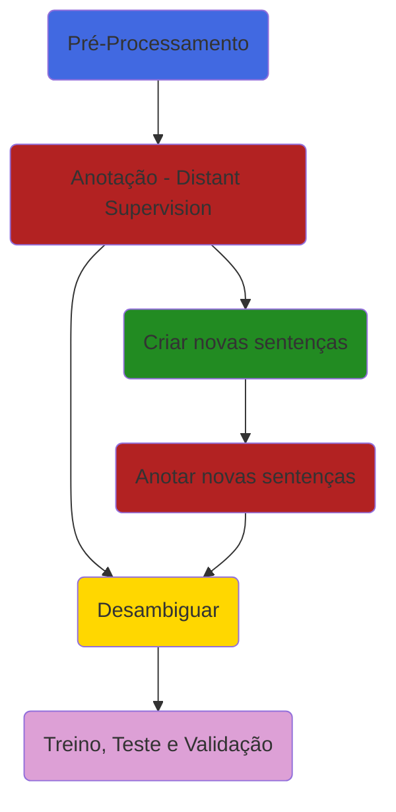
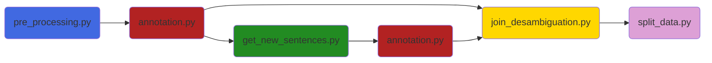

# Named Entity Recognition Dataset

## Observação
Para visualizar os diagramas presentes neste Readme instale a seguinte extensão **GitHub + Mermaid** no seu navegador:
 - **Google Chrome**: https://chrome.google.com/webstore/detail/github-+-mermaid/goiiopgdnkogdbjmncgedmgpoajilohe
 - **Firefoz**: https://addons.mozilla.org/pt-BR/firefox/addon/github-mermaid/

# Descrição do Projeto
Este repositório tem a função de aprensentar uma metodologia e as ferramentas para a criação de um banco de dados para o treinamento de uma rede neural para a tarefa de reconhecimento de entidades nomeadas (NER) utilizando para tal a técnica de **distant siupervision**. Uma visão geral da metodologia para a criação da base de dados pode ser obsvervada na figura abaixo.


- **Sequênciamento de scrips**



## Descrição do fluxo do projeto


 - **Pré-Processamento** Nesta etapa o texto contidos em todos os documentos .txt encontrados nas pastas dadas como entrada são lidos e sofrem uma limpeza.
   1. Remoção de caracteres especiais
   2. Separação da pontuação do texto (exemplo: teste: --> teste :) 
   3. O pré-processamento realizado realiza tranformações e limpezas de tal forma que as sentenças sejam semelhantes, em termos de formatação, às sentenças encontradas no **geocorpus** (uma espécie de dataset GOLDEN para a aplicação NER no domínio de Óle & Gás). Geocurpus está disponível em: https://github.com/jneto04/geocorpus
 
 - **Anotação:** Consiste me anotar as sentenças automaticamente no formato BIO, explicado anteriormente, utilizando a técnica de **distant supervison**. Utilizando como fonde de dados externos um conjunto de documentos relacionados ao domínio específico e listas de entidades.

#### Lista de estidades
As listas de entidades são formadas por palavras ou expressões relacionadas a uma classe de interesse no domínio de Óleo & Gás. A figura abaixo mostra a quantidade de palavras / termos relacionados de cada classe. Essaa foram fornecidas por especialistas da área.


 - **Aumento da base de dados:** esse passo não é obrigatório. Mas caso seja necessário criar mais dados utilizando a técnica de substituição de palavras / termos relacionados a cada classe para aumentar a quantidade de amostras e apliar o vocabulário com todas as palavras / termos relacionados conhecidos.
   1. **Criar novas sentenças:** Seleciona as sentenças  com uma classe específica e faz a substituição simples das palavras por uma regra de substituição e definição da quantidade de novas sentenças que serão criadas. 
   2. **Anotar novas sentenças:** Realiza o processo de anotação automática nas novas sentenças criadas. 
 - **Desambiguar:** Essa etapa ocorre da seguinte forma:
   1. Inicialmente selecionamos as sentenças anotadas inicialmente com o texto original e aplicamos o processo de desambiguação de dados (é criada uma nova coluna na tabela com a identifficação da sentença).
   2. Após isso, criamos o novo label de anotação unindo todas as classes, apenas para os casos onde não há ambiguidade ente as sentenças evitando multiplas anotações para um mesmo token.
   3. Identificamos amostras positivas e negativas.
   4. Salvamos o arquivo com as modificações sofridas.
   5. Os procedimentos acima citados são feitos para as sentenças modificadas anotadas no data augmentation (arquivos .csv dentro da pasta **augmentation**) 

 - **Treino, Teste e Validação:** Existem duas possibilidades de separação para o dataset
   1. Separação de treino + validação e teste por meio da sentença original.
   2. Separação de treino + validação e teste por meio do documento de origem da sentença.

O formato final e o tipo de anotação é descrito a seguir.

#### Dataset 
Os datasets de treinamento, validação e test são formado por sentenças cujos labels então no formato IOB. O formato IOB (abreviação de dentro, fora, início) é um formato de marcação comum para tokens de marcação em uma tarefa de agrupamento em linguística computacional (por exemplo , reconhecimento de entidade nomeada ). Ele foi apresentado por Ramshaw e Marcus em seu artigo "Text Chunking using Transformation-Based Learning", 1995.

-   _B_: é uma tag que indica o início de um trecho de texto que representa a entidade de interesse.
-   _I_: é uma tag que indica que a o token está dentro de um trecho de texto que representa a entidade de interesse.
-   _O_: é uma tag indica que um token não pertence a entidade de interece.

Para a meotodolia proposta neste projeto a composição do dataset é baseada na técnica de distant supervision utilizando para tal listas de palavras relacionadas a cada entidade de interesse (da organização ou pessoa que for utilizar essa metodologia).

Também foram utilizadas técnicas para aumentar a quantidade de dados de treinamento da base de dados utilizando o máximo de palavras ou trechos de texto que representem as entidades de interesse presentes nas listas fornecidas já fornecidas.

O formato final consistem em um .csv com os tokens e labels respectivos. Um exmeplo pode ser observado abaixo:

||0|	1	|sentence|
|--|--|-----|--|
|0|	as|	O	|72543|
|1|	facilidades	|O|	72543|
|2|	levaram	|O|	72543|
|3|	ao	|O|	72543|
|4|	uso	|O|	72543|
|5|	desenfreado	|O|	72543|
|6|	do	|O|	72543|
|7|	recurso	|O|	72543|
|8|	e	|O|	|72543|
|9|	segundo	|O	|72543|
|10|	os	|O|	72543|
|11|	catadores	|O|	72543|
|12|	isso	|O|	72543|
|13|	diminuiu	|O|	72543|
|14|	o	|O|	72543|
|15|	numero	|O|	72543|
|16|	de	|O|	72543|
|17|	7et0550rn	|B|	72543|
|18|	.	|O|	72543|
|21|	foi	|O|	48925|
|22|	descoberto	|O|	48925|
|23|	pelo	|O|	48925|
|24|	poco	|O|	48925|
|25|	3-brsa-1295-rn	|B|	48925|
|26|	em	|O|	48925|
|27|	agosto	|O|	48925|

 
# Passo a Passo

### Clone o repositório
```bash
git clone https://codigo-externo.petrobras.com.br/buscasemantica/puc-ica/reconhecimento-de-entidade/dataset-generator-distant-supervision.git
```

### Docker image

- Caminho SDU (.sif) 
```
/scratch/parceirosbr/buscaict/share/dockers/ner_pytorch_2.1_latest.sif
```
 - Docker pull (Docker Hub)
```
docker pull strink/relation-extraction:tf2.3
```
 - Docker build
```
docker build -t <docker image name:tag> .
```

### Em caso de execução local

```
docker run -it -v <local folder>:<docker folder> -u $(id -u):$(id -g) --net=host -e HOME=<docker folder> --rm <docker image name:tag> /bin/bash
```
```
jupyter notebook --ip=0.0.0.0 --port=<porta definida> --no-browser --allow-root --notebook-dir=<docker folder>
```

### Em caso de execução no Santos Dumond

Para rodar por meio de docker no SDU temos que utilizar o singularity, portanto após submeter o processo e entrar no nó que foi atribuído (por meio de ssh), dentro do nó podemos utilizar o singularity para abrir um container através de uma imagem já criada (.sif) deverá ser executado o seguinte comendo.

 - **Para filas de CPU**
```
ssh sdumont<NODE_ID>
```
 ```
singularity run -B <forder_share> <docker_path(.sif)> python script.py
```

### 1. Acessar pasta com scripts
```bash
cd ..dataset-generator-distant-supervision/src
```

### 2. Pré-processamento do texto
```bash
python pre_process_text.py --folders_files './texts/,./texts_2/' --out_folder '../output/'
```
|Parâmetro|Abreviação|Descrição|Observação|
|---------|----------|---------|----------|
|--folders_files|-i|Caminho das pastas contendo os .txts a serem usados para formar o conjunto de dados. |Se existir mais de uma pastas, elas devem ser separadas por vírgulas na string a ser passada para esse parâmetro.|
|--out_folder|-o|Pasta principals onde serão salvos os arquivos de saída.|Essa pasta vai conter subpastas com nomes já definidos.|
|--docs_limit|-dl|Limite de documentos que serão processados durante o processo|É um parâmentro limitador para realização de testes (se for igual a zero ele não limita a quantidade de documentos e entende que é a quantidade total presente nas pastas indicadas)|
 
### 3. Anotação do texto pré-processado
```bash
python annotation.py --inp_file '../output/full_text/full_text.json' --out_folder '../output/' -d '../data/' --number_of_processors 48 
```
|Parâmetro|Abreviação|Descrição|Observação|
|---------|----------|---------|----------|
|--inp_file|-i|Caminho das pastas contendo os .txts a serem usados para formar o conjunto de dados. |Se existir mais de uma pastas, elas devem ser separadas por vírgulas na string a ser passada para esse parâmetro.|
|--out_folder|-o|Pasta principals onde serão salvos os arquivos de saída.|Essa pasta vai conter subpastas com nomes já definidos.|
|--ner_list_folder|-d|Pasta contendo os .txts que contém as listas de palavras relacionadas a cada entidade.|É importante que o nome de cada arquivo .txt dessa pasta seja a entidade de enterece (**exemplo: poco.txt**)|
|--tipo|-t|Classe ner considerada.|Preenchido apenas quando se quer anotar sentenças criadas no sub-processo de aumento de dados.|
|--number_of_processors|-p|Número de processadores a serem utilizados para paralelizar as tarefas|Quanto mais processadores melhor é um processo demorado!!!|
|--number_of_chunks|-nc|Número de sub-processos.|Utilizado quando se tem bastante rucurso computacional disponível (várias máquinas) para reduzir o tempo de criação do dataset. Por default é igual a 1|
|--chunk_id|-ci|Id do processo a ser executado.|Vai do id=0 até o id=number_of_chunks-1|

### 4. Criar novas sentenças
```bash
python get_new_sentences.py --out_folder '../output/' --folder_ner_list '../data/' --number_of_processors 48 
```
|Parâmetro|Abreviação|Descrição|Observação|
|---------|----------|---------|----------|
|--out_folder|-o|Pasta principals onde serão salvos os arquivos de saída.|Essa pasta vai conter subpastas com nomes já definidos.|
|--folder_ner_list|-d|Pasta contendo os .txts que contém as listas de palavras relacionadas a cada entidade.|É importante que o nome de cada arquivo .txt dessa pasta seja a entidade de enterece (**exemplo: poco.txt**)|
|--tipo|-t|Classe ner considerada ou todas as classes se manter o dafault.|Em caso de definir um tipo cria-se apenas as sentenças relacionadas a aquela clsse específica definida.|
|--number_of_processors|-p|Número de processadores a serem utilizados para paralelizar as tarefas|Quanto mais processadores melhor é um processo demorado!!!|
|--limit_words|-l|Limita a quantidade de palavras da lista de entidades que serão usadas para realizar as substituições automáticas.|aconselhável limitar classes com grande quantidade de palavras (poco,litilogia,geocronologia,etc).|

### 5. Anotar novas sentenças
```bash
python annotation.py --out_folder '../output/' -d '../data/' --number_of_processors 48 --tipo 'campo' 
```
 - Nesse caso é necessário definir tipo (classe ner). Como são criadas uma quantidade considerável de novas sentenças é necessário ter um processo para cada classes e as vezes ainda subdividir esses processos. 
 - Pra subdividir cada processó é necessário definir também o **chunk_id** e o **number_of_chunks**. Como no exemplo abaixo:
```bash
python annotation.py --out_folder './output/' -d './data/' --number_of_processors 48 --tipo 'campo' --number_of_chunks 5 --chunk_id 0
python annotation.py --out_folder './output/' -d './data/' --number_of_processors 48 --tipo 'campo' --number_of_chunks 5 --chunk_id 1
python annotation.py --out_folder './output/' -d './data/' --number_of_processors 48 --tipo 'campo' --number_of_chunks 5 --chunk_id 2
python annotation.py --out_folder './output/' -d './data/' --number_of_processors 48 --tipo 'campo' --number_of_chunks 5 --chunk_id 3
python annotation.py --out_folder './output/' -d './data/' --number_of_processors 48 --tipo 'campo' --number_of_chunks 5 --chunk_id 4
```

### 6. Desambiguar dados e definir amostras positivas e negativas e um novo label multiclasse
```bash
python join_desambiguation.py --out_folder '../output/' --folder_ner_list '../data/' 
```
|Parâmetro|Abreviação|Descrição|Observação|
|---------|----------|---------|----------|
|--out_folder|-o|Pasta principals onde serão salvos os arquivos de saída.|Essa pasta vai conter subpastas com nomes já definidos.|
|--folder_ner_list|-d|Pasta contendo os .txts que contém as listas de palavras relacionadas a cada entidade.|É importante que o nome de cada arquivo .txt dessa pasta seja a entidade de enterece (**exemplo: poco.txt**)|

### 7. Criando o datasert final

```bash
python split_data.py --out_folder '../output/' --tipo 1 
```
|Parâmetro|Abreviação|Descrição|Observação|
|---------|----------|---------|----------|
|--out_folder|-o|Pasta principals onde serão salvos os arquivos de saída.|Essa pasta vai conter subpastas com nomes já definidos.|
|--tipo|-t|Tipo de divisão que será realizada.|Por dafault é igual a 1 (Separação de treino + validação e teste por meio da sentença original.). Mas também pode ser igual a 2 (Separação de treino + validação e teste por meio do documento de origem da sentença.)|

### Observações

 - Só é possível realizar os passos 4, 5, 6 e 7 após o término do passo 3.
 - Os passos 4 e 5 não são obrigatórios,mas eles auxiliam no processo de ampliar a base de dados, visto que nem sempre teremos texto suficiente contendo todas as informações de todas as classes. 
 - O processo geral é demorado e a depender do seu recurso computacional pode levar mais de um dia. 
 - Caso você tenha muitas máquinas disponíveis (como por exemplo no cluster Santos Dumond), utilize a maior quantidade possível e faça a subdivisão de processos. Reduz consideravelmente o tempo de criação da base de dados final. 


# Output 

- **Pastas e arquivos de saída:**

A pasta final contendo as saídas após todo o passo a passo contém a estrutura definida pela imagem abaixo:


O conteúdo de cada pasta é detalhado a seguir:

1. **full_text**: Nesta pasta será salvo um arquivo full_text.json com o texto pré-processado e seu respectivo documento de origem.


2. **aux**: É uma pasta auxiliar criada no caso de sub-dividir o processo de anotação dos dados em sub-processos (**num_of_chuncks diferente de 1**), desde que **não seja** para o processo de **data augmentation** (para o data augmentation é criada uma pasta própria). Neste caso ao realizar o processo de criação de novas sentenças, caso o processo de anotação inicial tenha sido sub-dividido em sub-processos será realizada a junção desses arquivos para formar os arquivos sentences.csv e sentences_annotation.csv que são necessários para criar novas sentenças.


3. **texts_augmentation**: Quando se cria novas sentenças durante o processo de **data augmentation** as novas sentenças com suas respectivas informações relevantes são salvas nesta pasta, sendo um arquivo .csv para cada tipo de entidade (é possível criar novas sentenças levando em conta uma classe específica se for necessário). O .csv contém a sentença modificada, a sentença original e o documento de origem).


4. **augmentation**: Nesta pasta são salvos os arquivos anotados para as sentenças modificadas no processo de **data augmentation**, separadas por classe, visto que podemos aumentar a quantidade de sentenças para classes específicas e obter grandes conjuntos de dados (na casa de GB de informação). O conteúdo da pasta é exemplificado na imagem abaixo:


Vale salientar que essa pasta pode ter sub-pastas, caso haja a necessidade de se subdividir os processos de anotação para pelo menos uma das classe (uma forma de aproveitar máquinas disponíveis caso seja necessário reduzir o tempo de criação da base de dados e aproveitar os recussos computacionais). A subpasta é organizada da seguinte forma, tendo como nome o nome da classe:


5. **result**: Após anottar as novas sentenças, temos que organizar os dados obtidos, realizar o processo de desambiguação de dados e selecionar as sentenças para treino, teste e validação. A pasta result recebe a versão final do dataset para treinamento do modelo no formato final. 


